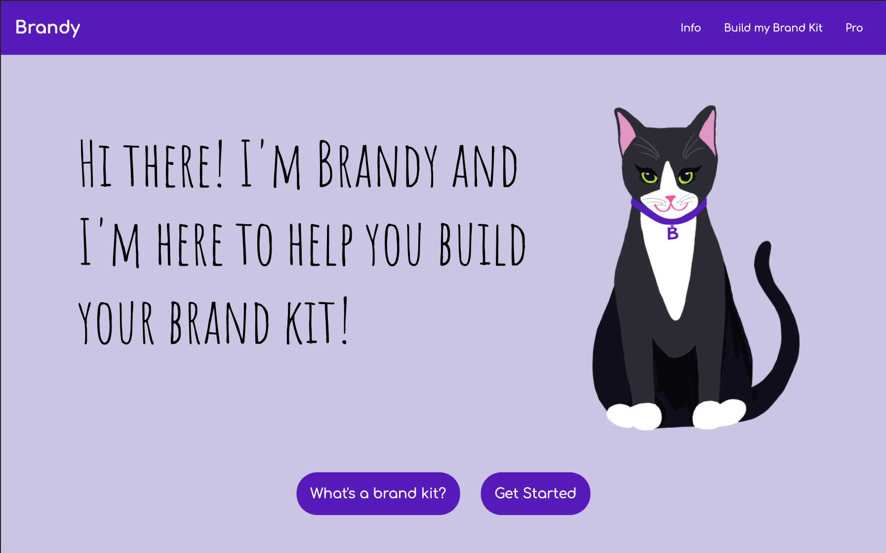
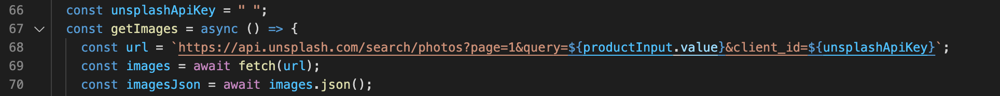

# Brandy

## Video Walk Through:

https://youtu.be/mTRFO0Wi55k

## Overview:

<!-- Sunny Side Up is a weather app that loads daily weather and weekly forecast for a city that the user looks up. Different egg images are loaded in the weather app depending on what the weather is for the day. The app merges functionality with entertainment for an enjoyable user experience. -->

## What I Used:

### Languages:

- HTML
- CSS
- Javascript

### API:

- [Tailwind Simeon Griggs Palette](https://tailwind.simeongriggs.dev/brand/2522FC)
- [Unsplash Images](https://openweathermap.org/api)

## Notes:

- In order to test the app, you will have to insert your own Unsplash Images api key in the unsplashApiKey variable string on line 66.

- Check out my [Dev To blog post](https://dev.to/ciaracloud/cats-and-apis-3h8o) about this project!
