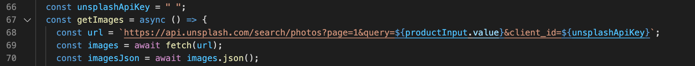

# Brandy

## Video Walk Through:

https://youtu.be/mTRFO0Wi55k

## Overview:

Brand kits are important for a brand because they include all elements of their visual brand identity and help build consistency surrounding their brand. Brandy is a website that generates a brand kit based on the information that the user inputs about their brand. The website also includes a cat mascot named Brandy that cheers the user on as they build their brand kit.

## What I Used:

### Languages:

- HTML
- CSS
- Javascript

### APIs:

- [Tailwind Simeon Griggs Palette](https://tailwind.simeongriggs.dev/brand/2522FC)
- [Unsplash Images](https://openweathermap.org/api)

## Notes:

- In order to test the app, you will have to insert your own Unsplash Images api key in the unsplashApiKey variable string on line 66.

- Check out my [Dev To blog post](https://dev.to/ciaracloud/cats-and-apis-3h8o) about this project!
